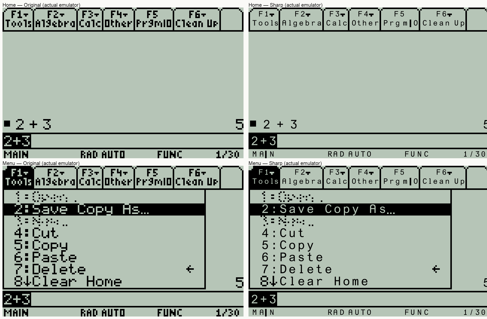
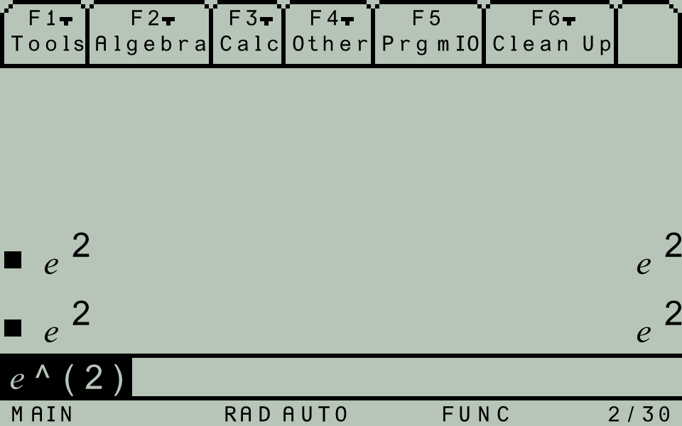
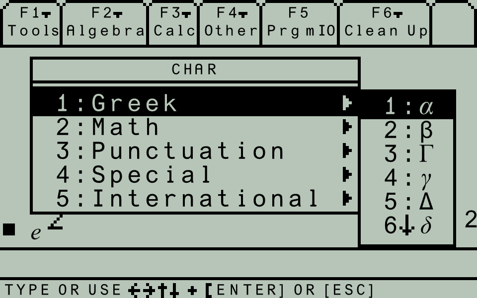
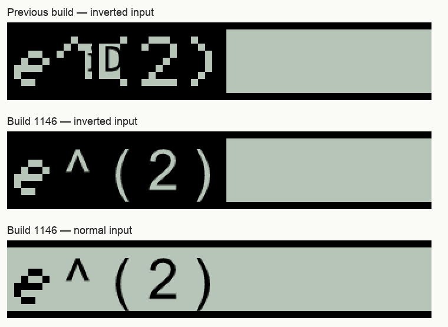
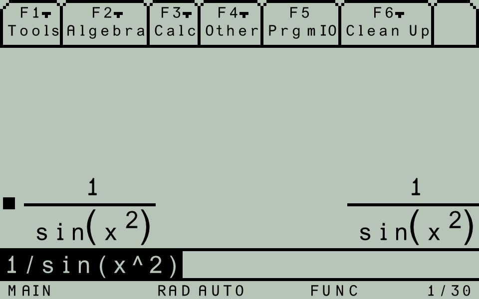
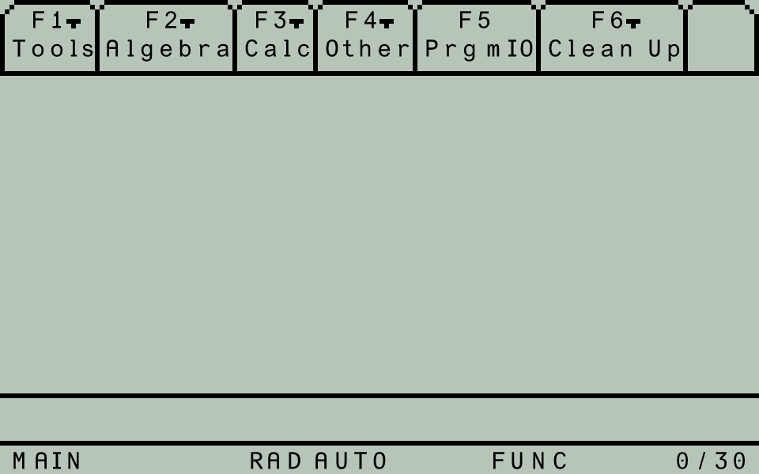
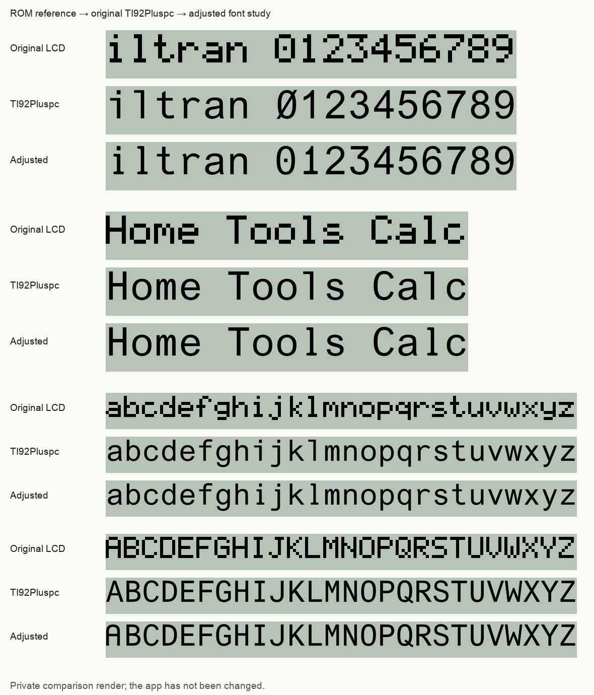
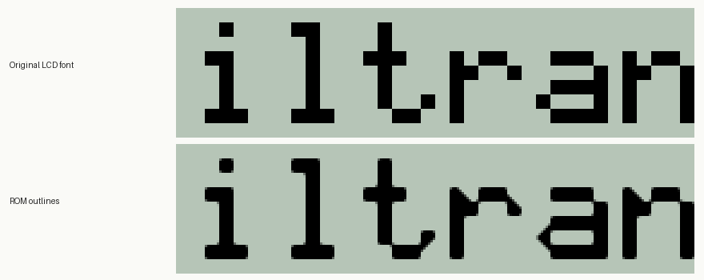

# Sharp text prototype (Android ARM64, build 1150)

Install the updated 64-bit APK, open system Back → Configuration Settings → Display Settings, and enable **Sharp Text (Prototype)**. Unchecking it restores the original calculator LCD. It is off by default, and the setting is saved separately for each calculator instance. The prototype requires the Solid LCD setting with grayscale disabled; otherwise the original display is drawn automatically. The same Sharp Text feature is available on iOS.



## How it works

The read-only JNI helper locates the ROM's standard font attributes (0x300, 0x301, 0x302) and reads its small proportional, medium, and large glyph templates. Templates come from the user's currently loaded firmware; no firmware or font tables are embedded in the app. Unsupported table layouts fall back to the original display.

The Java recognizer checks exact cell pixels, including normal and inverse text, and groups matches into text runs. In the recognized Home layout it also accepts isolated result letters/numbers, including small-font superscripts. Those matches require a clear border around the actual glyph ink, rather than the wider cell padding. Pretty-print parentheses use a separate exact shape check: the ROM repeats a straight middle between two diagonal caps. Matching pairs with recognized text inside are redrawn at their original width and height. Android draws matched ASCII characters with the approved TI92Pluspc-based vector face bundled in `assets/fonts/Graph89HD.ttf`. This replaces the rejected bitmap-contour tracing renderer. The approved v8 edits include the dotted zero, 1's curved upper arc with a horizontal underside and softened bottom serif, narrower/softer i/j/l appendages, and changes to 3, A, and t. Seven and all descender outlines retain the original TI92Pluspc shapes.

The renderer uses a uniform scale, including the face's full descenders and round-letter overshoot, to fit the original text cell. It does not compress descenders or stretch letters sideways. Variable-height pretty-print parentheses are an exception: the approved parenthesis outline is sized independently in each direction to match the ROM delimiter rectangle. Character positions and spacing remain controlled by the ROM. The variable-width small font can use a smaller uniform size in a narrow cell. Only original glyph ink bounds are cleared; live cursor pixels in padding remain visible. The original 160 × 100 layout, arithmetic, key handling, and emulated CPU execution are unchanged. The built-in Take Screenshot action also respects the toggle. The overlay uses the bitmap's actual destination dimensions, including the legacy integer-zoom case where the skin rectangle and bitmap height differ.

Each updated screen is recognized afresh. Previously recognized letters are also checked against their current pixels so loss of surrounding run context does not make unchanged text flicker back to bitmap text. Only solid cursor columns or a bottom underline are allowed to change in cell padding; drawing replaces the glyph ink rectangle and leaves that padding visible. Changed or cleared glyph pixels immediately invalidate the overlay. The shared native retained-text layer now supplies validated ROM character identities and positions first, with this recognizer as fallback. Captured text is invalidated when glyph pixels change, the screen clears, or a saved state loads. Bitmap save/restore and selection inversion preserve validated identities; cursor padding remains visible. No timed stale-text hold is used. When the graph toolbar is recognized, the plotting area stays original; its toolbar/status text can still be sharp. The CPU loop has a page-filtered capture hook, active only with Sharp Text enabled. It does not throttle or modify guest state. Screen recognition/rendering still adds host work when the option is enabled; phone performance has not been measured.

## Prototype limits

Standard ASCII and the 45 approved Greek/math glyphs in `approved-specials.json` are redrawn. Other special glyphs, accented letters, dynamically assembled fraction/radical bars, icons, clipped ink, disabled/dithered text, and unmatched glyphs retain their original pixels. The approved integral also replaces the Home pretty-print five-column integral: its fixed caps and repeatable stem are checked at each height, in either polarity, with adjacent expression context. Clipped or malformed integrals remain original. The square-root glyph is a standard font character; dynamically sized radicals are not covered. Small-font I and vertical-bar glyphs share a bitmap. In toolbar/status words, a directly adjacent letter provides context to draw I. Isolated bars and bars in the display body remain original; lines continuing beyond the text cell remain graphics. Cached I recognition also requires current word context. Characters whose original bitmaps are identical cannot be semantically distinguished by recognition. Matching pixels does not provide the ROM's semantic text information: a sufficiently text-like graphic could still be mistaken for a text run outside the excluded graph area. Custom RAM font replacements and localized graph toolbars are not covered. The toggle makes the exact original presentation available at any time.

## Verification, 2026-10-09: Approved derivative and dropdown

Build 1150 integrates the approved derivative d (ROM code 188) using the existing `uniE008` source-font outline at all three ROM font sizes. The 45 font-symbol mappings are recorded in `approved-specials.json`. Every prior glyph outline, metric, and cmap entry is unchanged; the new d mapping points to the exact preview outline.

The approved toolbar dropdown is a filled triangle within the original 3 × 2 pixel footprint. It is rendered as a vector path, with geometry recorded in `approved-home-symbols.json`, rather than a scaled font character. Recognition requires its exact original bitmap directly beside a recognized F1–F8 label in the bordered top toolbar, in the same polarity. Disabled tiles remain excluded. Cached arrows require fresh context; changed arrows and isolated triangle-shaped graphics remain original.

All font-symbol editor regressions and dedicated normal/inverse dropdown, disabled-label, changed-arrow, and isolated-graphic regressions pass. The previous integral/disabled-menu regressions also pass. Visually verified derivative input, derivative pretty print, integral dx, normal/inverse dropdowns, and history selection in the Android emulator. All four disabled toolbar sections were byte-for-byte identical with Sharp Text on/off. ARM64 release build/lint and APK signature passed; the APK font payload matches the production asset. [Integrated Home screenshot](home-symbols-integrated.png). [Approved comparison](approved-home-symbols.png).

## Verification, 2026-10-09: Home integral and disabled toolbar

Build 1149 adds exact recognition of variable-height Home pretty-print integrals, using the existing approved integral outline stretched to its native ink rectangle. Normal and inverse selections are supported; cap changes invalidate cached matches. Recognition requires complete caps and adjacent expression text. Normal integrals require a clear ink border; inverse selection boundaries may touch the integral, so exact inverse geometry plus selected expression context validates them. Graph-area exclusion remains in force. Home detection also recognizes Tools/Prgm toolbar context with editor borders when Algebra is disabled during history browsing.

A toolbar exclusion pass checks the 16-row bordered F-key layout. A populated tile without an intact F1–F8 label retains its original pixels throughout the tile; neither fresh fragments nor cached letters can overwrite it. This fixes the disabled Home-menu corruption. Synthetic tests cover integral heights 9/14/24/40, inverse selections, cap edits, graphic/graph rejection, and fresh/cached disabled-tile exclusions. Actual emulator checks cover ordinary/fraction-height integrals and history browsing. Disabled tile crops were byte-for-byte identical with Sharp Text on and off. ARM64 build/lint and all recognition regressions pass.

Derivative d (ROM code 188, source-font outline `uniE008`) and the three-by-two toolbar dropdown arrow are preview-only, pending approval. `preview-home-symbols.py` writes a comparison and a temporary font under ignored build output; it does not alter the app font or recognition mappings. All 44 approved special outlines and ASCII glyph designs remain unchanged. [New-symbol approval comparison](pending-home-symbols.png).

## Verification, 2026-10-09: Catalog

Build 1148 recognizes the consecutive medium/large-font `e^(` token outside Home, including the Catalog row. Generic runs normally require two letter/digit or approved-special anchors; this token contains only one and was rejected. The exception requires all three adjacent cells, retaining the existing graph-area exclusion. Font outlines and metrics are unchanged.

Verified the actual Catalog E section in an isolated Android emulator: italic e, caret, and opening parenthesis are sharp. Synthetic regressions cover normal/inverse complete tokens, rejection of incomplete/separated tokens, and graph-area exclusion. All existing recognition regressions and the ARM64 release build/lint pass. [Catalog verification screenshot](catalog-exponential-fixed.png).

## Verification, 2026-10-08

Build 1147 integrates the full approved v4 batch of 44 specials, including italic e, imaginary i, symmetric infinity, and the revised alpha/Gamma/gamma/delta/lambda. All ASCII outlines and metrics are unchanged from approved v8; all special outlines and metrics match approved v4. `build-special-font.py` and `approved-specials.json` preserve the recipe and mappings. The existing ASCII family bounds continue to set the renderer scale, so integrating specials does not resize other text.

Synthetic tests cover all 44 mappings in normal/inverse editor text, and a private check against the actual ROM's medium font templates found all 44 exact approved identities, with no aliases. Visually checked italic e in normal/inverse input and pretty-print results, Greek menu normal/inverted symbols, and the math symbol menu. Across 20 frames of actual normal `e^(2)` input, lettering had one identical pixel state and the cursor two. Existing regressions and the ARM64 release build/lint pass. Sharp Text remains a toggle; iOS is unchanged. Physical S22 Ultra verification remains needed.




The complete approved special comparison sheets are retained in `approved-specials-math.png` and `approved-specials-greek.png`. Symbols whose bitmaps collide with other glyphs in other font sizes remain subject to bitmap-recognition ambiguity; unsupported drawing layouts still fall back to pixels.

Build 1146 fixes the remaining corruption in inverted Home input and sharpens ordinary input parentheses/carets. When the Home toolbar and the TI-89 editor's horizontal dividers are present, its eight-row input line is recognized on its native six-column medium-font grid. Punctuation no longer requires a two-letter run; unmatched cells (including italic e) stay original. The entire editor line is reserved against off-grid small-font matches, in either polarity. Cached editor cells are reacquired on that grid each frame. This fixed-grid path is specific to the 160 × 100 TI-89 layout; other layouts keep the generic recognition path.

Verified real `e^(2)` input normally and inverted on the Android emulator. The caret and both parentheses are sharp, the false i/D overlay is gone, and italic e remains original. Across 20 normal input frames, text had one pixel state and the cursor two. New synthetic tests cover normal/inverse punctuation beside an unsupported cell containing a false small-font i/D run, cursor-on reacquisition, and clearing. Existing pretty-print and menu regressions, ARM64 release build/lint and signature verification pass. Font outlines are unchanged.



Build 1145 fixes corruption when the exponential key inserts `e^(`. Small inverted matches in the display body now require an actual inverse background around their ink; the same validation applies to cached matches. Previously, negative space inside the normal exponential token/parenthesis was accepted as an inverted i/D run. The unsupported exponential glyph stays in original pixels. Checked eight actual ROM cursor frames with the recognizer and 20 live frames of the rebuilt Android app: token pixels had one identical state, cursor pixels had two. Genuine inverted menu selection still renders sharply. Synthetic regressions cover rejection of inverse fragments, acceptance of a real inverse selection, and cache invalidation when its background disappears. Existing regressions and ARM64 release build/lint pass. No font shapes changed.

Build 1144 fixes the raised 2 and variable-height parentheses in `1/sin(x^2)`. On the isolated Android 11 ARM64 emulator, verified that expression, nested exponents in `sin(x^(x^2))`, and nested parentheses in `sin((x^2)^3)`. Standalone synthetic regressions cover raised digits beside delimiter caps, small-font superscripts, nested delimiter pairs at different heights, changed/cleared expressions, unpaired and empty curves, connected graphics rejection, and graph-area fallback. Existing recognition regressions, ARM64 release build/lint, and APK signature verification pass. The font asset itself is unchanged; this does not add general radical, bracket, or special-symbol recognition.



Build 1143 fixes small-font I in labels such as MAIN and PrgmIO without changing the approved font outlines. Synthetic regressions cover normal/inverse words, isolated bars, display-body exclusion, continuing box dividers, and loss of neighbouring word context. Recognition of MAIN and PrgmIO was also verified against the actual local ROM pixels and visually checked on the isolated Android emulator. ARM64 release build/lint, regression tests, and APK signature verification pass. No font outlines changed.



Build 1142 integrates the approved font into the app and its screenshot export. ARM64 release build/lint and standalone recognition regressions pass. A new regression covers reacquiring text when the two-column ROM cursor already fills trailing padding; changed letter ink still invalidates the overlay. The original LCD toggle remains available. On the isolated Android 11 ARM64 emulator, `2+3` returned `5`, normal and inverse menu text were checked, and the toggle restored the original LCD. Across 70 captured Home frames, toolbar and `i1jlpqgy` letter pixels each had one identical state; the cursor region had exactly two states. No Android runtime crash was logged. The final APK signature verifies and its font file is byte-for-byte identical to approved v8. Physical S22 Ultra confirmation is still needed.

The full approved font comparison is retained below; the live runtime screenshots above use the same glyph outlines at a uniform size appropriate to the ROM cells.



### Earlier prototype checks

The initial prototype checks below also cover display modes, screenshots, and graph fallback. Build 1141 additionally passed release build/lint and ROM-outline tests, including detached dots, serifs, counter holes, diagonal connectivity, and all 512 possible 3 × 3 bitmaps. Its lettering was inspected on the isolated emulator with `iltran`, Home arithmetic, and inverse menu selection. Across 70 captured Home frames, the entire typed text stayed identical; the only changing input pixels were the blinking cursor. The original-display toggle was checked again. No Android runtime crash was logged.



- ARM64 optimized release build and release lint passed. Development signing certificate verified. Only `arm64-v8a` native libraries are included.
- On a separate Android 11 ARM64 emulator with the local TI-89 Titanium AMS 3.10 image: visually checked Home, Apps launcher labels, a menu, and inverse menu selection; touch-key arithmetic `2+3` returned `5`.
- Exported a sharp Home screenshot through the built-in Take Screenshot dialog and visually verified it at its native 480 × 300 size.
- Changed Sharp Text off/on through Configuration Settings and verified the saved preference. A cold process restart restored the same sharp Home LCD, pixel-for-pixel.
- Compared the graph plotting rectangle with the toggle on/off: identical pixels. Enabled grayscale with Sharp Text still selected and verified original-display fallback. Checked alignment after changing the test device's display width.
- Standalone synthetic-font regressions cover ordinary and inverse text, unrelated graphics, changed glyphs, clearing, scrolling, isolated-shape rejection, a clipped blank column at the display edge, blinking cursor padding, lost word context, selection inversion, and immediate cached-glyph invalidation. No ROM needed:

```sh
bash android/tests/sharp-text.sh
```

The screenshots above are from the test emulator. Physical Galaxy S22 Ultra testing is still needed.

Font API background: [TI's font description](https://education.ti.com/en/customer-support/knowledge-base/other-graphing/product-usage/12138) and [GCC4TI graphics documentation](https://debrouxl.github.io/gcc4ti/graph.html).

Build 1140 follow-up: 70 captured Home frames with typed narrow letters had identical toolbar and letter pixels; only the cursor changed (two states). Touch-key `2+3` returned `5`, inverse menu text and the original-display toggle were checked again, and no Android runtime crash was logged. This does not reproduce every possible S22 Ultra screen transition; physical-device confirmation is still needed.

## Retained text layer

Both platforms share the same native capture mechanism and approved font. Actual Home, Tools, Catalog, editor, pretty-print, history selection and menu restoration checks pass; all 19 original LCD frames are identical with capture enabled, and the Android/Swift merge results match. Tall mathematical shapes and untracked drawing remain on the existing fallback. See [implementation, limits and isolated checks](../../tools/drawing-trace/README.md).

### Tall mathematical shapes and selection

Tall parentheses are checked in both normal and inverted text, with pairs required to have matching height and polarity. After native character identities are merged, a second exact-shape pass uses those character positions to validate integrals and parentheses. This avoids rejecting valid selected expressions because a background border is clipped, or because limits/fractions separate the integrand from the integral stem. Complete caps and stems remain mandatory; clipped or altered shapes stay original. Shape detection can replace conflicting pixel-recognized fragments but cannot overwrite verified native characters, editor text, disabled toolbar tiles or graph areas. Approved outlines are unchanged.

Actual-ROM checks cover a 25-row integral and paired parentheses in normal and inverted history selection. Java/Swift behavior matches on all 21 captured screens; existing graph, clearing, changed-cap and disabled-menu regressions pass.

### Approved Catalog triangle

ROM character 18 now uses the approved filled right-pointing triangle in both renderers, including normal/inverse conversion commands and the Catalog selection pointer. Its vertices use the original glyph ink bounds; the medium-font path is `(1,1) → (4,3.5) → (1,6)`. Character advance and padding stay unchanged. It is drawn as a vector path, separately from the shafted arrow (ROM code 22); the TTF and earlier glyph designs are unchanged.

Clipped text and tall math (2026-10-10): the retained layer now preserves partially visible ROM characters and captures integral/parenthesis geometry before clipping. The approved outlines are drawn at their full original height and clipped to the calculator's own viewport, including inverted selections. Font designs are unchanged. Unknown internal ROM instruction layouts retain pixel fallback.

Inverse trig raised −1 (Android build 1152): ROM character 180 now uses the approved size-specific composition of the existing minus and numeral 1. The three new font outlines use 200 units per LCD pixel and a baseline at y=10; both renderers use the same fixed transform, preserving the approved preview in normal and inverted text. Reproduce these additions with `android/sharp-text/build-inverse-trig-font.py INPUT_TTF OUTPUT_TTF` after the other approved font integration steps. Earlier outlines and advances remain unchanged.

Home editor cursor (Android build 1153): capture the verified two-column, eight-row XOR rectangle call in the medium-font Home input line. A cursor packet (font 4) carries its position and the rows already toggled. Native validation and both recognizers remove those XOR pixels from a host copy before comparing glyphs, including snapshots partway through a blink. This avoids invalidating a neighboring glyph when the cursor overlaps its ink. Both HD renderers restore that original text and draw a centered 0.6-LCD-pixel cursor, preserving the calculator's position and blink timing. Original Display keeps the native cursor. No guest framebuffer or font outline is changed. Actual-ROM checks cover end/middle cursor positions and both blink phases across 40 frames, plus 64 validations during row-by-row cursor redraw; Android/iOS merge parity covers 67 frames.
